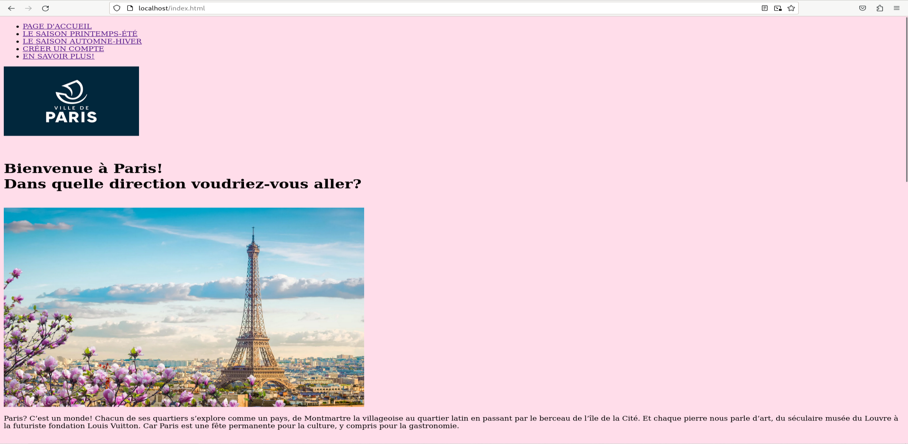
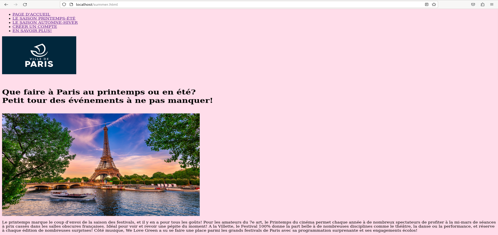
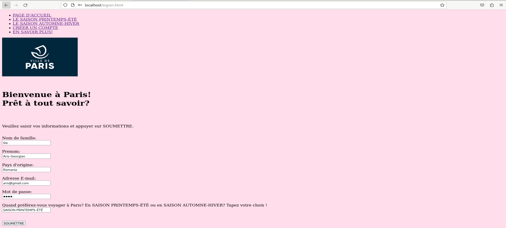
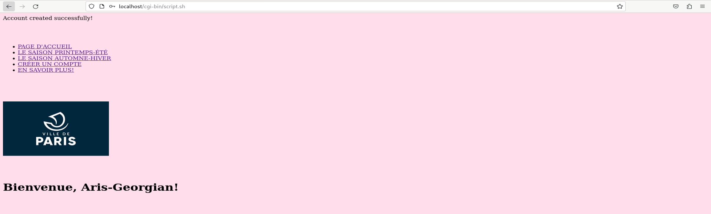
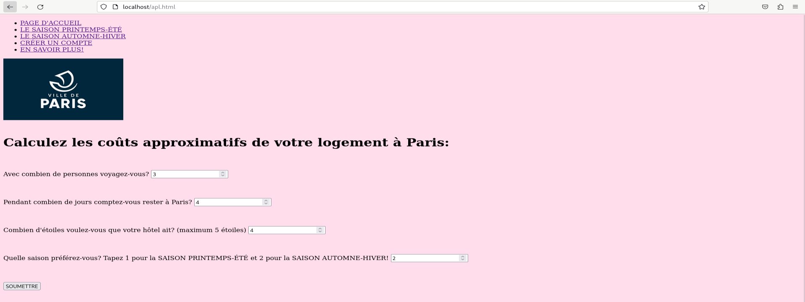
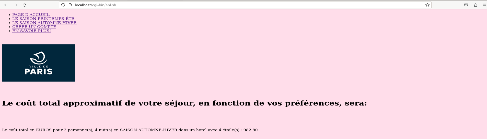

<h1 align="center"><strong>Paris Travel - Mini Web Application</strong></h1>
<h3 align="center" style="color: gray; font-weight: normal;">- Linux, CGI Bash & MariaDB Web Application -</h3>

  <strong>Author:</strong> ILIE Aris-Georgian &nbsp;|&nbsp;
  <strong>Group:</strong> 1231 FA

---

## TABLE OF CONTENTS

- [DESCRIPTION](#description)
- [MOTIVATION](#motivation)
- [HOW THE CODE WORKS](#how-the-code-works)
  - [1. Reading Form Data (Bash CGI)](#1-reading-form-data-bash-cgi)
  - [2. Saving Users to the Database (MariaDB)](#2-saving-users-to-the-database-mariadb)
  - [3. Calculating the Budget (Math in Bash)](#3-calculating-the-budget-math-in-bash)
- [USER INTERFACE AND DEMONSTRATION](#user-interface-and-demonstration)
- [TECHNOLOGIES USED](#technologies-used)

---

## DESCRIPTION

This is a lightweight travel recommendation web application deployed on a Linux server. Instead of using a modern backend framework like Node.js or Spring Boot, it runs entirely on <strong>CGI (Common Gateway Interface) shell scripts</strong> written in Bash. 

The site provides navigation pages for seasonal travel tips (spring/summer and autumn/winter), an account creation system that saves user data into a MariaDB database, and a dynamic cost estimator. The budget estimator takes user inputs (like group size, nights, and hotel rating), calculates an approximate price using shell math tools, and generates a custom HTML response on the fly.

---

## MOTIVATION

The goal of this project was to understand the foundational layers of web servers and databases. By building a web app without heavy frameworks, it demonstrates exactly how HTTP POST requests are received by a Linux server, how scripts parse raw text data, and how a backend communicates directly with an SQL database via the command line. It is an exercise in creating full end-to-end functionality—from HTML forms to database storage—using only the native tools available in a Linux terminal.

---

## HOW THE CODE WORKS

Because this project uses Bash for the backend, the server executes a shell script every time a user submits a form. Here is a look at the specific code that makes this happen:

### 1. Reading Form Data (Bash CGI)
When you submit an HTML form, the data is sent to the server as a single, long text string. The script needs to break this string apart to read the individual inputs.

<table style="width:100%; table-layout: fixed;">
  <tr>
    <td style="width: 55%; font-family: monospace; background-color:#f4f4f4; padding:10px; border-radius:6px; word-wrap: break-word;">
read -n $CONTENT_LENGTH POST_DATA 
IFS='=&' 
array_post=($POST_DATA) 
for ((i=0; i&lt;${#array_post[@]}; i+=2)) 
do 
&nbsp;&nbsp;&nbsp;&nbsp;declare ${array_post[i]}=${array_post[i+1]} 
done
    </td>
    <td style="vertical-align:top; text-align:justify; padding-left:15px;">
      <strong>Parsing the HTTP Request:</strong>  
      The script uses the <code>CONTENT_LENGTH</code> environment variable to know exactly how many characters to read from the incoming POST request.   
      It sets the Internal Field Separator (<code>IFS='=&'</code>) so the string splits automatically at every <code>=</code> and <code>&</code> symbol. It then loops through the resulting array and creates local Bash variables matching the HTML input names (e.g., turning <code>name=Ilie</code> into a variable <code>$name</code> holding the value <code>Ilie</code>).
    </td>
  </tr>
</table>

### 2. Saving Users to the Database (MariaDB)
Once the 'script.sh' CGI file has parsed the form inputs (like '$name', '$prenom', and '$mail'), it needs to save them to the database.

<table style="width:100%; table-layout: fixed;">
  <tr>
    <td style="vertical-align:top; text-align:justify; padding-right:15px;">
      <strong>Direct SQL Execution:</strong>  
      The script uses the <code>mariadb</code> command-line tool. It connects as the user <em>aaris</em> and executes an <code>INSERT INTO</code> statement, placing the Bash variables directly into the SQL query.  
      After the query runs, the script checks the exit status (<code>$?</code>). If it fails (not equal to 0), it prints an error message. If it succeeds, it uses a <code>cat &lt;&lt;EOT</code> block to send a personalized "Welcome" HTML page back to the user's browser.
    </td>
    <td style="width: 55%; font-family: monospace; background-color:#f4f4f4; padding:10px; border-radius:6px; word-wrap: break-word;">
mariadb -u aaris -e "USE Accounts_data; 
INSERT INTO Infos (Nom_de_famille, Prenom, Pays_origine, Adresse_email, Mot_passe, Saison)  
VALUES ('$name', '$prenom', '$pays', '$mail', '$motpasse', '$saison')" 
 
if [ $? -ne 0 ] 
then 
&nbsp;&nbsp;echo "User already created!" 
&nbsp;&nbsp;echo "&lt;a href='../signin.html'&gt;Go back.&lt;/a&gt;" 
else 
&nbsp;&nbsp;echo "Account created successfully!" 
&nbsp;&nbsp;cat&lt;&lt;EOT 
&nbsp;&nbsp;&lt;!DOCTYPE html&gt; 
&nbsp;&nbsp;... 
&nbsp;&nbsp;&lt;h1&gt;Bienvenue, $prenom!&lt;/h1&gt; 
&nbsp;&nbsp;... 
EOT 
fi
    </td>
  </tr>
</table>

### 3. Calculating the Budget (Math in Bash)
The 'apl.sh' script calculates an estimated trip price based on the number of people, days, hotel stars, and season.

<table style="width:100%; table-layout: fixed;">
  <tr>
    <td style="width: 55%; font-family: monospace; background-color:#f4f4f4; padding:10px; border-radius:6px; word-wrap: break-word;">
if [ "$stars" -ge 1 ] && [ "$stars" -le 5 ]; then 
&nbsp;&nbsp;&nbsp;&nbsp;STARS_FACTOR=$(echo "scale=2; 1 + 0.1 * $stars" | bc) 
else 
&nbsp;&nbsp;&nbsp;&nbsp;STARS_FACTOR=1.5 
fi 
 
TOTAL_COST=$(echo "scale=2; $numeropersonnes * $numerojours * $BASE_PRICE_PER_NIGHT * $PERSON_FACTOR * $SEASON_FACTOR * $STARS_FACTOR" | bc) 
 
TOTAL_COST_FORMATTED=$(LC_NUMERIC=fr_FR.UTF-8 printf "%.2f" $TOTAL_COST)
    </td>
    <td style="vertical-align:top; text-align:justify; padding-left:15px;">
      <strong>Floating Point Math via 'bc':</strong>  
      Standard Bash cannot handle decimals (floating-point math). To solve this, the script sends the mathematical formulas to <code>bc</code> (Basic Calculator) using the <code>echo "..." | bc</code> command, keeping 2 decimal places (<code>scale=2</code>).  
      Finally, it uses <code>printf</code> with a specific locale (<code>fr_FR.UTF-8</code>) to format the total cost nicely before injecting it into the final HTML output.
    </td>
  </tr>
</table>

---

## USER INTERFACE AND DEMONSTRATION

The web application uses a clean, simple HTML layout. The focus is on functionality and testing the server-side scripts. Below is a full view of the application's interface.

### 1. Navigation & Content
The homepage and seasonal pages (like Spring/Summer) offer information about Paris. Navigation links are handled by standard HTML files served directly by the web server.

  

  

  <em>Example of the homepage and a static content page showing recommendations for Summer.</em>

 

 

### 2. Account Creation
Users input their details into an HTML form. Upon clicking "Soumettre", the data is POSTed to the 'script.sh' CGI script, which saves the record into the MariaDB database.

  

  

  <em>The HTML form (top) and the dynamic HTML response (bottom) sent back by the Bash script after a successful database insertion, greeting the user by name.</em>

 

 

### 3. Price Calculator Inputs
Users select how many people are traveling, the duration of the stay, the hotel star rating, and their preferred season to calculate a rough budget.

  

  

  <em>The form (top) and the final output generated by 'apl.sh' (bottom). The script calculates the total price based on the multipliers and displays the formatted result.</em>

---

## TECHNOLOGIES USED

<table>
  <thead>
    <tr>
      <th><strong>Technology</strong></th>
      <th><strong>Role in the Project</strong></th>
    </tr>
  </thead>
  <tbody>
    <tr>
      <td align="center"><strong>Linux & Bash Scripting</strong></td>
      <td align="justify">Acts as the backend server logic. Shell scripts parse data, make logical decisions, and generate HTML output dynamically.</td>
    </tr>
    <tr>
      <td align="center"><strong>MariaDB (SQL)</strong></td>
      <td align="justify">The relational database used to permanently store the user accounts created through the registration form.</td>
    </tr>
    <tr>
      <td align="center"><strong>CGI (Common Gateway Interface)</strong></td>
      <td align="justify">The protocol that allows the web server to run the Bash scripts and pass the user's HTTP POST data into them.</td>
    </tr>
    <tr>
      <td align="center"><strong>GNU 'bc'</strong></td>
      <td align="justify">A command-line basic calculator used inside the scripts to handle decimal multiplication for the budget estimates.</td>
    </tr>
    <tr>
      <td align="center"><strong>HTML & CSS</strong></td>
      <td align="justify">Creates the structure, forms, and basic visual layout of the web pages viewed by the user.</td>
    </tr>
  </tbody>
</table>
